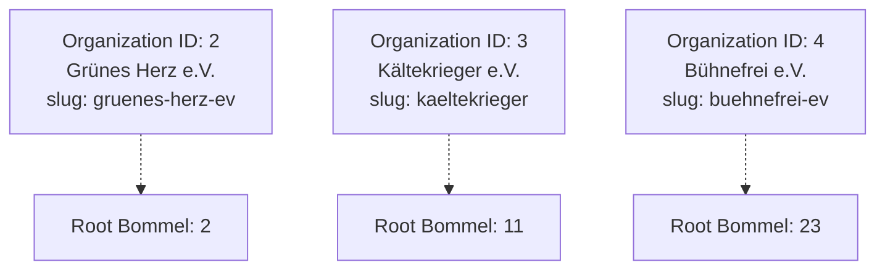
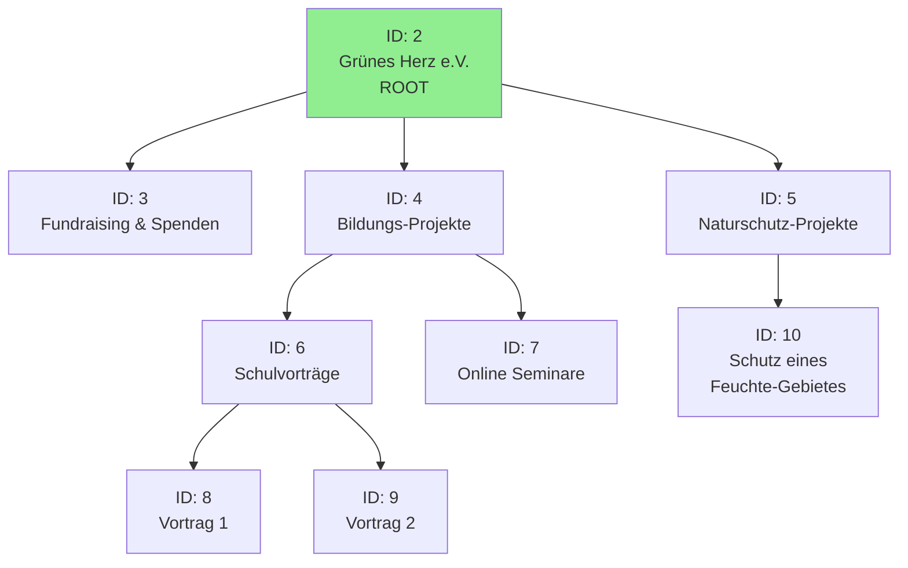
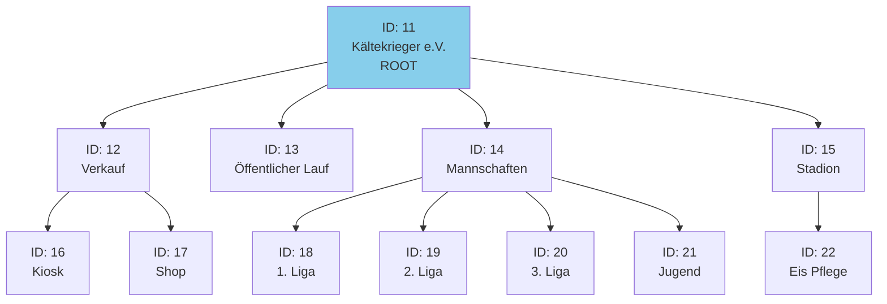
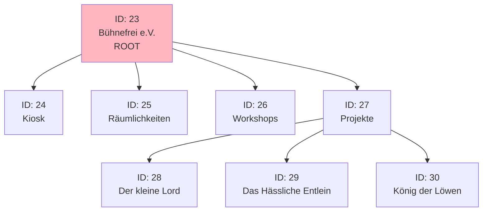
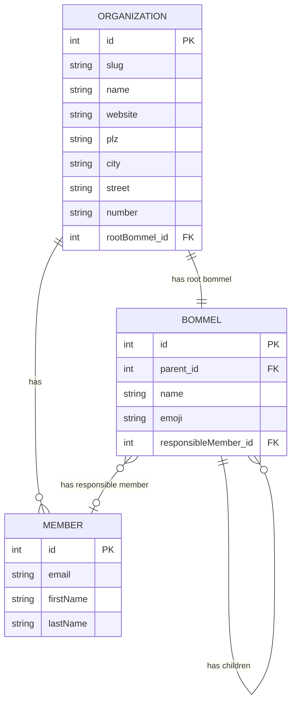

# Test Data Visualization

This document visualizes the test data structure defined in `testdata/testdata.yaml`.

> **Note:** Test data is now loaded via the `TestdataBootstrapper` service from YAML, not via Flyway SQL migrations.
> See `src/main/resources/testdata/testdata.yaml` for the actual data definitions.

## Organizations Overview

## Organization 1: Grünes Herz e.V. (ID: 2)

### Members
- ID 2: Emanuel Urban (emanuel_urban@domain.none)
- ID 3: Hartlieb Reuter (hartlieb-reuter@xyz.none)
- ID 4: Elgard Nicklas (elgard-nicklas@trashmail.none)
- ID 5: Gerald Geiger (gerald.geiger@company.none)
- ID 6: Jannick Cao (jannick.1923@net-mail.none)
- ID 7: Constance Wendling (constance.wendling@justmail.none)
- ID 8: Florenz Häfner (florenz-huefner@spam-mail.none)

### Bommel Hierarchy

## Organization 2: Kältekrieger e.V. (ID: 3)

### Members
- ID 9: Herlind Kutscher (h1978@company.none)
- ID 10: Annekathrin Feldhof (annekathrinfeldhoff@inter-mail.none)
- ID 11: Rosegunde Wilhelmy (rosegunde-19@anymail.none)
- ID 12: Eckhard Weirich (eckhardweirich@spam-mail.none)
- ID 13: Godo Beckers (g_2011@inter-mail.none)
- ID 14: Klothilde Püppel (klothilde1916@net-mail.none)

### Bommel Hierarchy

## Organization 3: Bühnefrei e.V. (ID: 4)

### Members
- ID 15: Samantha Adomeit (samantha1284@net-mail.none)
- ID 16: Margund Linner (m-linner@private.none)
- ID 17: Birgit Bork (b-bork@mymail.none)
- ID 18: Gunther Kalb (gkalb@quickmail.none)
- ID 19: Burckhard Schlicker (b-schlicker@trashmail.none)
- ID 20: Alix Raff (alix1980@validmail.none)
- ID 21: **Alice Musterfrau** (alice@example.test) ← Used in tests
- ID 22: **Jdoe Mustermann** (jdoe@example.test) ← Used in tests
- ID 23: **Bob Mustermann** (bob@example.test) ← Used in tests

### Bommel Hierarchy

## Complete Entity Relationship

## Key Test Users

| User | Email | Organization | Member ID | Common Use Case |
|------|-------|--------------|-----------|-----------------|
| Alice | alice@example.test | Bühnefrei e.V. | 21 | Primary test user in DocumentResourceTest |
| Jdoe | jdoe@example.test | Bühnefrei e.V. | 22 | Secondary test user |
| Bob | bob@example.test | Bühnefrei e.V. | 23 | OAuth test user in TransactionRecordResourceTest |

## Important Bommel IDs for Testing

| Bommel ID | Name | Organization | Type | Note |
|-----------|------|--------------|------|------|
| 2 | Grünes Herz e.V. | Grünes Herz e.V. | Root | First organization root |
| 11 | Kältekrieger e.V. | Kältekrieger e.V. | Root | Second organization root |
| 23 | Bühnefrei e.V. | Bühnefrei e.V. | Root | Test user organization root (alice@example.test) |
| 24 | Kiosk | Bühnefrei e.V. | Child | Direct child of root |
| 30 | König der Löwen | Bühnefrei e.V. | Leaf | Referenced in DocumentResourceTest:107 |

## Sequence Values

After data initialization, sequences are set to:
- `Bommel_SEQ`: 30
- `Organization_SEQ`: 4
- `Member_SEQ`: 20

Next IDs will be 31, 5, and 21 respectively.
