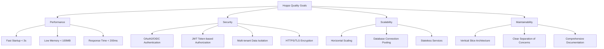
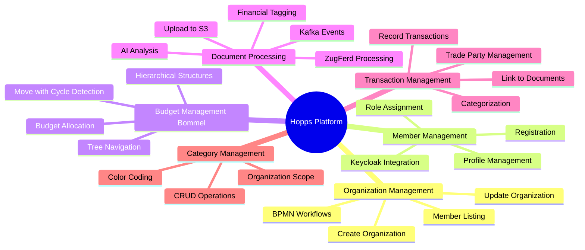

# 1. Introduction and Goals

## Overview

**Hopps** is a comprehensive web-based platform designed for managing German organizations and associations (Vereine e.V.). The system provides complete lifecycle management for organizations, members, budgets, financial transactions, and document processing with AI-powered analysis capabilities.

The platform enables associations to digitize their administrative processes, manage hierarchical budget structures, process financial documents automatically, and maintain member relationships efficiently through modern web and mobile applications.

---

## Requirements Overview

### Core Business Requirements

#### Organization Management
- Create, update, and manage association/organization profiles
- Multi-tenant architecture with organization isolation
- Support for German association structures (Verein e.V.)
- Organization lifecycle management via BPMN workflows
- Owner and administrator role management

#### Member Management
- Member registration and profile management
- Integration with Keycloak for identity management
- Role-based access control (RBAC)
- Member-organization relationship management
- Multi-organization membership (planned)

#### Hierarchical Budget Management (Bommel Tree)
- Create and manage hierarchical budget structures
- Tree navigation with parent-child relationships
- Move budget nodes with cycle detection
- Recursive tree queries for budget analysis
- Budget allocation and tracking

#### Document Processing
- Document upload with secure S3 storage
- AI-powered document analysis and extraction
- Support for invoices, receipts, and general documents
- ZugFerd invoice format processing
- Financial narrative tagging with AI
- Document submission workflows via BPMN

#### Transaction Management
- Record and track financial transactions
- Link transactions to documents
- Trade party management (suppliers, customers)
- Transaction categorization and reporting

#### Category Management
- Create organization-specific expense categories
- Color-coded category visualization
- Category-based transaction classification

---

## Functional Goals

### FG-1: Self-Service Organization Creation
**Priority:** High
**Description:** Enable users to create new organizations independently through a guided BPMN process that includes validation, Keycloak user creation, and initial setup.

### FG-2: Intelligent Document Processing
**Priority:** High
**Description:** Automatically extract information from uploaded documents (invoices, receipts) using AI analysis, reducing manual data entry.

### FG-3: Flexible Budget Structures
**Priority:** High
**Description:** Support complex hierarchical budget structures that reflect real-world organizational needs with unlimited depth.

### FG-4: Secure Multi-Tenancy
**Priority:** Critical
**Description:** Ensure complete data isolation between organizations with secure authentication and authorization.

### FG-5: Mobile Access
**Priority:** Medium
**Description:** Provide React Native mobile applications for on-the-go access to organization data.

### FG-6: API-First Design
**Priority:** High
**Description:** Expose all functionality through well-documented REST APIs with OpenAPI/Swagger specifications.

---

## Quality Goals

| Priority | Quality Attribute | Scenario | Target Metric |
|----------|------------------|----------|---------------|
| 1 | **Performance** | Backend service startup time | < 3 seconds (Quarkus fast startup) |
| 1 | **Security** | Authentication & Authorization | 100% Keycloak OAuth2/OIDC, JWT tokens |
| 2 | **Scalability** | Concurrent users per organization | 100+ users with horizontal scaling |
| 2 | **Availability** | System uptime | 99.5% availability in production |
| 3 | **Maintainability** | Code organization | Vertical Slice Architecture for high cohesion |
| 3 | **Usability** | User interface responsiveness | < 200ms response for UI interactions |
| 4 | **Testability** | Test coverage | > 80% code coverage with unit/integration tests |
| 4 | **Observability** | Monitoring & Logging | Prometheus metrics, structured logging |

### Quality Attribute Tree

---

## Stakeholders

### Internal Stakeholders

| Role | Description | Expectations |
|------|-------------|--------------|
| **Organization Owners** | Founders/leaders of associations who create and manage organizations | Easy setup, comprehensive control, secure data management |
| **Organization Administrators** | Assigned admins who manage members and budgets | Intuitive administration tools, bulk operations, reporting |
| **Finance Managers** | Handle financial documents and transactions | Fast document processing, accurate extraction, audit trails |
| **Members** | Regular users who participate in the organization | Simple interface, mobile access, transparent budget visibility |

### Technical Stakeholders

| Role | Description | Expectations |
|------|-------------|--------------|
| **Backend Developers** | Develop and maintain Quarkus microservices | Clear architecture, good documentation, testability |
| **Frontend Developers** | Build React SPA and React Native apps | Well-defined APIs, consistent API contracts, TypeScript support |
| **DevOps Engineers** | Deploy and maintain infrastructure | Docker/Kubernetes support, monitoring, CI/CD integration |
| **QA Engineers** | Test functionality and quality | Test automation, comprehensive test coverage, Pact contract testing |
| **Security Team** | Ensure secure operation | Keycloak integration, secure coding practices, vulnerability management |

### External Stakeholders

| Role | Description | Expectations |
|------|-------------|--------------|
| **End Users** | Members of various organizations using Hopps | Reliability, data privacy, user-friendly experience |
| **Auditors** | May need to verify financial records | Complete audit trails, transparent transaction history |
| **Integration Partners** | External systems integrating with Hopps | Stable APIs, clear documentation, versioning strategy |

---

## System Features

### Feature Set Overview

### Feature Priority Matrix

| Feature | Business Value | Technical Complexity | Priority |
|---------|---------------|---------------------|----------|
| Organization CRUD | Critical | Medium | P0 |
| Keycloak Authentication | Critical | High | P0 |
| Member Management | High | Medium | P0 |
| Document Upload | High | Medium | P1 |
| AI Document Analysis | High | High | P1 |
| Bommel Tree Structure | High | High | P1 |
| Transaction Recording | Medium | Low | P2 |
| Category Management | Medium | Low | P2 |
| Mobile App | Medium | High | P3 |
| Reporting & Analytics | Medium | Medium | P3 |

---

## Constraints

### Technical Constraints

- **Programming Language:** Java 21 (backend), TypeScript (frontend)
- **Framework:** Quarkus 3.19.2 for backend services
- **Database:** PostgreSQL with Flyway migrations
- **Authentication:** Keycloak (no custom auth implementation)
- **Cloud Storage:** AWS S3 for document storage
- **Container Platform:** Docker and Kubernetes

### Organizational Constraints

- **Team Size:** Small development team (implied by architecture choices)
- **Time-to-Market:** Vertical Slice Architecture enables rapid feature delivery
- **Budget:** Open-source first approach (Quarkus, Keycloak, PostgreSQL)

### Regulatory Constraints

- **Data Protection:** GDPR compliance for German/European users
- **Financial Records:** Proper audit trails for associations
- **German Association Law:** Support for Verein e.V. legal structures

---

## Success Criteria

The Hopps platform will be considered successful when:

1. ✅ **Functional Completeness:** All P0 and P1 features implemented and tested
2. ✅ **Performance Target:** Backend startup < 3 seconds, UI response < 200ms
3. ✅ **Security Compliance:** All API endpoints protected, OWASP Top 10 addressed
4. ✅ **User Adoption:** Active organizations using the platform for daily operations
5. ✅ **Test Coverage:** > 80% code coverage with automated tests
6. ✅ **Documentation:** Complete arc42 architecture documentation (this document!)
7. ✅ **Deployment Automation:** CI/CD pipeline with automated testing and deployment

---

## Scope and Boundaries

### In Scope
- Organization/association management for German Vereine
- Member and user management via Keycloak
- Document upload and AI-powered processing
- Hierarchical budget structures (Bommel tree)
- Transaction recording and categorization
- Web SPA and mobile applications
- Multi-tenant architecture with data isolation

### Out of Scope (Current Phase)
- Accounting software integration (DATEV, etc.)
- Payroll management
- Direct bank integration
- Multi-language support (German only initially)
- Public website hosting
- Event management
- Fundraising/donation campaigns

### Future Enhancements
- Advanced reporting and analytics
- Export to standard accounting formats
- Bank statement import
- Document OCR for handwritten receipts
- Budget forecasting with ML
- Collaborative budget planning

---

## Architecture Principles

The Hopps platform follows these core architectural principles:

1. **Vertical Slice Architecture:** Organize code by business capabilities, not technical layers
2. **API-First:** All functionality exposed through REST APIs with OpenAPI specs
3. **Security by Default:** Every endpoint protected, secure by design
4. **Cloud-Native:** Built for containerization and Kubernetes deployment
5. **Microservices:** Independent services with clear boundaries
6. **Event-Driven:** Kafka for asynchronous communication where appropriate
7. **Test Automation:** Comprehensive test coverage with Pact contract testing
8. **Observability:** Prometheus metrics, structured logging, health checks

---

## Related Documentation

- [Architecture Constraints](02_architecture_constraints.md) - Technical and organizational constraints
- [System Context](03_context.md) - External interfaces and boundaries
- [Solution Strategy](04_solution_strategy.md) - Key architectural decisions
- [Building Blocks](05_building_blocks.md) - System decomposition and structure

---

**Document Version:** 1.0
**Last Updated:** 2025-11-12
**Status:** Active
