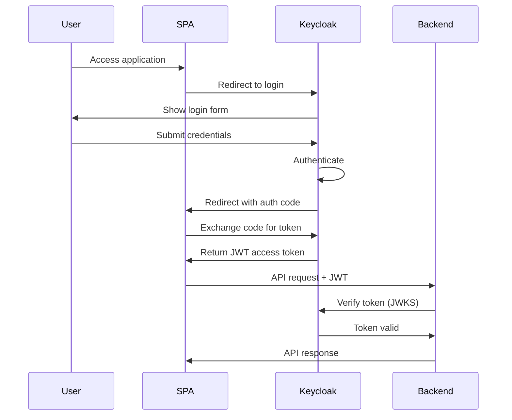
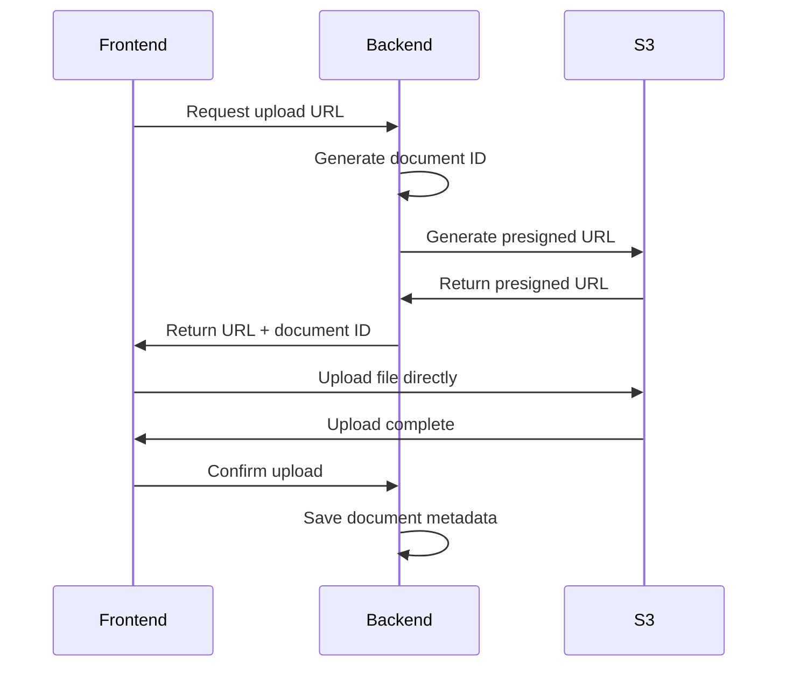
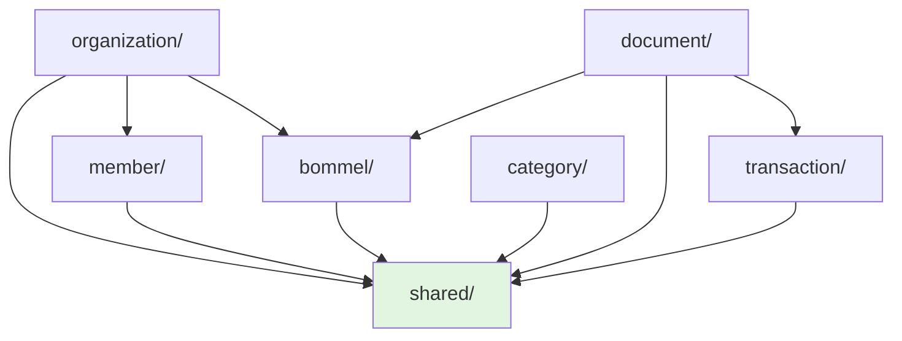
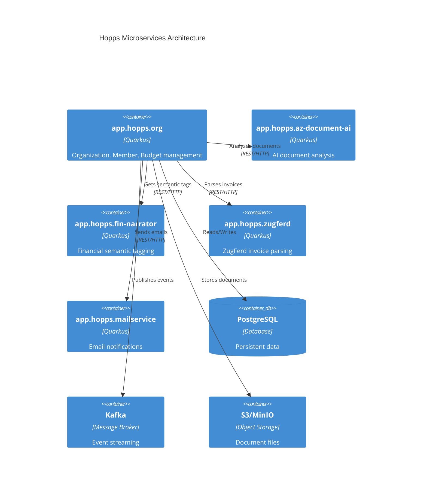
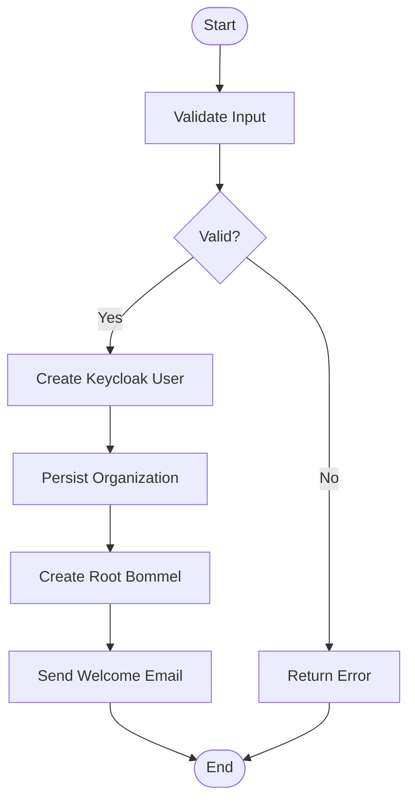
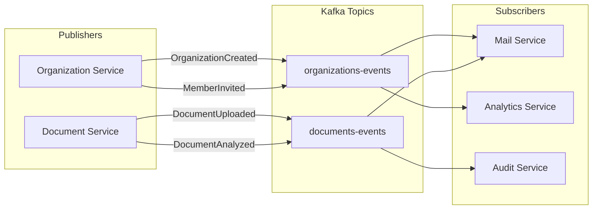
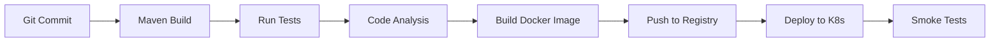

# 4. Solution Strategy

This chapter describes the fundamental decisions and solution approaches that shape the Hopps platform architecture.

---

## Technology Decisions

### TD-1: Quarkus for Backend Services

**Decision:** Use Quarkus 3.19.2 as the primary backend framework.

**Rationale:**
- **Supersonic Startup:** < 3 seconds startup time enables rapid development and testing
- **Subatomic Memory:** < 100MB memory footprint reduces infrastructure costs
- **Container-First:** Designed for Kubernetes and cloud-native deployments
- **Developer Joy:** Live reload, unified configuration, excellent tooling
- **Native Compilation:** GraalVM support for even faster startup and lower memory
- **Standards-Based:** JAX-RS, CDI, JPA, MicroProfile - portable across platforms

**Alternatives Considered:**
- **Spring Boot:** Rejected due to slower startup (15-30s) and higher memory usage (200-300MB)
- **Micronaut:** Similar benefits to Quarkus but smaller ecosystem
- **Ktor/Kotlin:** Would require team retraining from Java

**Impact:**
- Fast feedback loops in development
- Efficient resource utilization in production
- Excellent cloud-native characteristics
- Strong community and commercial support (Red Hat)

---

### TD-2: PostgreSQL as Primary Database

**Decision:** PostgreSQL as the single source of truth for all persistent data.

**Rationale:**
- **Mature and Reliable:** 30+ years of development, proven at scale
- **ACID Compliance:** Essential for financial data integrity
- **Advanced Features:**
  - Recursive CTEs for Bommel tree queries
  - JSONB for flexible document metadata
  - Full-text search capabilities
  - Window functions for analytics
- **Open Source:** No licensing costs, strong community
- **Excellent Quarkus Integration:** Hibernate ORM, Panache, Flyway

**Schema Management Strategy:**
- **Flyway Migrations:** Version-controlled, incremental schema changes
- **Forward-Only:** No rollback scripts, only forward migrations
- **Convention:** `V{version}__{description}.sql`

**Example Migration:**
```sql
-- V1__create_organization.sql
CREATE TABLE organization (
    id BIGSERIAL PRIMARY KEY,
    name VARCHAR(255) NOT NULL,
    slug VARCHAR(100) UNIQUE NOT NULL,
    street VARCHAR(255),
    city VARCHAR(100),
    postal_code VARCHAR(20),
    country VARCHAR(2) DEFAULT 'DE',
    created_at TIMESTAMP NOT NULL DEFAULT NOW(),
    updated_at TIMESTAMP NOT NULL DEFAULT NOW()
);

CREATE INDEX idx_organization_slug ON organization(slug);
```

---

### TD-3: Keycloak for Identity Management

**Decision:** Delegate all authentication and user management to Keycloak.

**Rationale:**
- **Industry Standard:** OAuth2/OIDC compliant
- **Feature Complete:**
  - User registration and profile management
  - Social login integration
  - Multi-factor authentication (MFA)
  - Fine-grained authorization (optional)
- **Admin API:** Programmatic user creation (organization owner onboarding)
- **Customizable:** Themes, email templates, authentication flows
- **Open Source:** Red Hat backed, enterprise-grade

**Integration Pattern:**


**User Creation During Organization Onboarding:**
```java
@ApplicationScoped
public class CreateUserInKeycloak implements WorkItemHandler {
    @Inject @RestClient Keycloak keycloak;

    public void createUser(String email, String firstName, String lastName) {
        UserRepresentation user = new UserRepresentation();
        user.setEmail(email);
        user.setUsername(email);
        user.setEnabled(true);

        // Create user with temporary password
        keycloak.realm("hopps").users().create(user);

        // Send verification email
        keycloak.realm("hopps")
            .users().get(userId)
            .sendVerifyEmail();
    }
}
```

---

### TD-4: React for Frontend

**Decision:** React for both web (SPA) and mobile (React Native) applications.

**Rationale:**
- **Code Sharing:** Business logic shared between web and mobile
- **Component-Based:** Reusable UI components
- **Large Ecosystem:** Libraries for routing, state management, UI components
- **TypeScript Support:** Type-safe frontend development
- **Developer Experience:** Hot module reload, excellent tooling

**Architecture:**
- **Web:** React SPA with Vite build tool
- **Mobile:** React Native with Expo framework
- **State Management:** React Context API (lightweight) or Redux (if needed)
- **API Client:** TypeScript client generated from OpenAPI spec

**Shared Code Structure:**
```
frontend/
├── api-client/          # Generated from OpenAPI
│   ├── src/
│   │   ├── models/      # TypeScript interfaces
│   │   └── apis/        # API client methods
│   └── package.json
│
├── spa/                 # React web application
│   ├── src/
│   │   ├── components/  # Reusable UI components
│   │   ├── pages/       # Page components
│   │   ├── hooks/       # Custom React hooks
│   │   └── services/    # API service layer
│   └── package.json
│
└── mobile/              # React Native app
    ├── src/
    │   ├── components/  # Mobile-specific components
    │   ├── screens/     # App screens
    │   └── navigation/  # Navigation config
    └── package.json
```

---

### TD-5: AWS S3 for Document Storage

**Decision:** Store all uploaded documents in S3-compatible object storage.

**Rationale:**
- **Scalability:** Unlimited storage capacity
- **Durability:** 99.999999999% (11 9's) durability
- **Cost-Effective:** Pay per GB, cheaper than database storage
- **Presigned URLs:** Secure direct upload/download from frontend
- **S3-Compatible:** MinIO for local development, seamless transition

**Document Storage Strategy:**
```
Bucket: hopps-documents-{environment}
Key Pattern: {organizationId}/{documentType}/{year}/{documentId}.{ext}

Example:
s3://hopps-documents-prod/123/invoices/2024/doc-456.pdf
```

**Upload Flow:**


**Benefits:**
- Frontend uploads directly to S3 (no backend bottleneck)
- Backend only handles metadata
- Reduced bandwidth and processing on backend
- Better scalability

---

## Architectural Patterns

### AP-1: Vertical Slice Architecture

**Decision:** Organize backend code by business capabilities (vertical slices) rather than technical layers.

**Traditional Layered Architecture Problems:**
```
❌ Problems with Layered Architecture:
app.hopps/
├── controller/
│   ├── OrganizationController.java
│   ├── MemberController.java
│   └── DocumentController.java
├── service/
│   ├── OrganizationService.java
│   ├── MemberService.java
│   └── DocumentService.java
├── repository/
│   ├── OrganizationRepository.java
│   └── MemberRepository.java
└── model/
    ├── Organization.java
    └── Member.java

Problems:
- To understand "Organization" feature, must navigate 4 packages
- Adding new feature touches multiple layers
- High coupling across layers
- Low cohesion within layers
```

**Vertical Slice Architecture Solution:**
```
✅ Vertical Slice Architecture:
app.hopps/
├── shared/                    # Cross-cutting only
│   ├── security/
│   └── validation/
│
├── organization/              # Complete feature
│   ├── api/
│   │   └── OrganizationResource.java
│   ├── domain/
│   │   └── Organization.java
│   ├── repository/
│   │   └── OrganizationRepository.java
│   ├── service/
│   │   └── OrganizationService.java
│   └── model/
│       └── OrganizationInput.java
│
├── member/                    # Complete feature
│   ├── api/
│   ├── domain/
│   ├── repository/
│   └── service/
│
└── document/                  # Complete feature
    ├── api/
    ├── domain/
    ├── service/
    └── client/

Benefits:
- All organization code in one place
- High cohesion within slice
- Low coupling between slices
- Easy to understand and navigate
- Team can own entire slice
```

**Slice Dependency Rules:**


**Rules:**
1. ✅ All slices can depend on `shared/`
2. ⚠️ Minimal cross-slice dependencies (well-defined interfaces)
3. ❌ `shared/` cannot depend on any slice
4. ❌ Circular dependencies between slices forbidden

**Implementation Reference:**
See [backend-vertical-slice-implementation-summary.md](../backend-vertical-slice-implementation-summary.md) for complete migration details.

---

### AP-2: Microservices Architecture

**Decision:** Decompose backend into specialized microservices.

**Service Boundaries:**



**Service Responsibilities:**

| Service | Responsibility | Technology | Port |
|---------|---------------|------------|------|
| **app.hopps.org** | Main business logic (organizations, members, budgets, documents, transactions) | Quarkus 3.19.2 | 8080 |
| **app.hopps.az-document-ai** | AI-powered document analysis and OCR | Quarkus + ML models | 8081 |
| **app.hopps.fin-narrator** | Semantic tagging of financial transactions | Quarkus + NLP | 8082 |
| **app.hopps.zugferd** | ZugFerd electronic invoice parsing | Quarkus + XML | 8083 |
| **app.hopps.mailservice** | Email sending and templating | Quarkus + SMTP | 8084 |

**Communication Patterns:**
- **Synchronous:** REST/HTTP for request-response
- **Asynchronous:** Kafka for events (document uploaded, transaction created)
- **Service Discovery:** Kubernetes DNS (service-name.namespace.svc.cluster.local)

---

### AP-3: BPMN for Business Processes

**Decision:** Use Kogito BPMN for orchestrating complex business workflows.

**Rationale:**
- **Visual Modeling:** Non-developers can understand process flow
- **Versioning:** Process definitions version-controlled
- **Audit Trail:** Complete history of process execution
- **Flexibility:** Easy to modify business rules
- **Integration:** Service tasks call Java delegates

**Example: Organization Creation Process**



**BPMN Implementation:**
```xml
<!-- NewOrganization.bpmn -->
<bpmn2:process id="NewOrganization" name="New Organization Creation">

  <!-- Validation Task -->
  <bpmn2:serviceTask id="validate" name="Validate"
                     implementation="Java"
                     operationRef="CreationValidationDelegate"/>

  <!-- Create Keycloak User -->
  <bpmn2:serviceTask id="createUser" name="Create User"
                     implementation="Java"
                     operationRef="CreateUserInKeycloak"/>

  <!-- Persist Organization -->
  <bpmn2:serviceTask id="persist" name="Persist"
                     implementation="Java"
                     operationRef="PersistOrganizationDelegate"/>

  <!-- Exclusive Gateway for error handling -->
  <bpmn2:exclusiveGateway id="gateway"/>

</bpmn2:process>
```

**Java Delegate Example:**
```java
@ApplicationScoped
@Named("PersistOrganizationDelegate")
public class PersistOrganizationDelegate implements WorkItemHandler {

    @Inject
    OrganizationRepository repository;

    @Override
    @Transactional
    public void executeWorkItem(WorkItem workItem, WorkItemManager manager) {
        Map<String, Object> params = workItem.getParameters();

        Organization org = new Organization();
        org.setName((String) params.get("name"));
        org.setSlug((String) params.get("slug"));

        repository.persist(org);

        Map<String, Object> results = Map.of("organizationId", org.id);
        manager.completeWorkItem(workItem.getId(), results);
    }
}
```

**Benefits:**
- Business logic visible in BPMN diagram
- Easy to add steps (e.g., approval workflow)
- Retry logic for failures
- Process monitoring and analytics

---

### AP-4: Event-Driven Architecture with Kafka

**Decision:** Use Kafka for asynchronous event-driven communication.

**Event Types:**



**Event Schema Example:**
```java
public record DocumentUploadedEvent(
    String documentId,
    String organizationId,
    String uploadedBy,
    String documentType,
    String s3Key,
    Instant timestamp
) {}
```

**Publisher:**
```java
@ApplicationScoped
public class DocumentProducer {

    @Channel("documents")
    Emitter<String> documentEmitter;

    @Inject
    ObjectMapper mapper;

    public void publishDocumentUploaded(DocumentUploadedEvent event) {
        try {
            String json = mapper.writeValueAsString(event);
            documentEmitter.send(json);
            LOG.info("Published document uploaded event: {}", event.documentId());
        } catch (JsonProcessingException e) {
            LOG.error("Failed to serialize event", e);
        }
    }
}
```

**Configuration:**
```yaml
mp:
  messaging:
    outgoing:
      documents:
        connector: smallrye-kafka
        topic: documents-events
        value:
          serializer: org.apache.kafka.common.serialization.StringSerializer
```

**Benefits:**
- Loose coupling between services
- Scalable event processing
- Event history for debugging
- Easy to add new consumers

---

## Security Strategy

### SS-1: OAuth2/OIDC with JWT

**Strategy:** Token-based authentication with Keycloak as identity provider.

**Flow:**
1. User authenticates with Keycloak
2. Keycloak issues JWT access token
3. Frontend includes token in Authorization header
4. Backend validates token signature using Keycloak JWKS
5. Backend extracts user identity from token claims

**JWT Structure:**
```json
{
  "header": {
    "alg": "RS256",
    "typ": "JWT",
    "kid": "key-id-123"
  },
  "payload": {
    "sub": "user-uuid",
    "email": "user@example.com",
    "preferred_username": "user@example.com",
    "realm_access": {
      "roles": ["user", "admin"]
    },
    "organization": "org-123",
    "exp": 1699876543,
    "iat": 1699872943
  },
  "signature": "..."
}
```

**Backend Validation:**
```java
@Path("/organizations")
@Authenticated
public class OrganizationResource {

    @Inject
    SecurityUtils securityUtils;

    @GET
    @Path("/my")
    public Organization getMyOrganization(@Context SecurityContext ctx) {
        // SecurityContext automatically populated by Quarkus
        // JWT validated by quarkus-keycloak-authorization
        return securityUtils.getUserOrganization(ctx);
    }
}
```

---

### SS-2: Multi-Tenant Data Isolation

**Strategy:** Organization-scoped data access with automatic filtering.

**Implementation:**
```java
@ApplicationScoped
public class SecurityUtils {

    @Inject
    MemberRepository memberRepository;

    public Organization getUserOrganization(SecurityContext ctx) {
        String email = ctx.getUserPrincipal().getName();
        Member member = memberRepository.findByEmail(email);

        if (member == null) {
            throw new WebApplicationException(404);
        }

        Collection<Organization> orgs = member.getOrganizations();

        // Currently support single organization per user
        return orgs.stream()
            .findFirst()
            .orElseThrow(() -> new WebApplicationException(404));
    }
}
```

**Usage in Resources:**
```java
@GET
public List<Bommel> list(@Context SecurityContext ctx) {
    Organization org = securityUtils.getUserOrganization(ctx);
    return bommelRepository.find("organization", org).list();
}
```

**Future Enhancement: OpenFGA**
```java
// Fine-grained authorization with OpenFGA
@Inject
OpenFGAClient fga;

public boolean canEdit(String userId, String documentId) {
    return fga.check(
        user: "user:" + userId,
        relation: "editor",
        object: "document:" + documentId
    );
}
```

---

## Data Management Strategy

### DM-1: Single Database per Service

**Strategy:** Each microservice has its own database schema.

**Schema Organization:**
```sql
-- app.hopps.org database
CREATE SCHEMA public;  -- Main schema

-- Tables
public.organization
public.member
public.bommel
public.category
public.document_metadata
public.transaction_record

-- Future: Separate databases for true microservices isolation
-- hopps_org database
-- hopps_documents database
```

---

### DM-2: Event Sourcing for Audit Trail

**Strategy:** Critical events stored in Kafka for audit and replay.

**Event Store:**
- Kafka topic with long retention (90 days+)
- Events immutable (append-only)
- Complete history of state changes
- Replay capability for debugging

---

## Testing Strategy

### TS-1: Multi-Level Testing

**Test Pyramid:**
```
         /\
        /  \  E2E (5%)
       /----\
      / Inte \  Integration (20%)
     / gration\
    /----------\
   /   Unit     \  Unit (75%)
  /--------------\
```

**Test Types:**

| Level | Tool | Scope | Example |
|-------|------|-------|---------|
| **Unit** | JUnit 5, Mockito | Single class | Test `BommelRepository.getParents()` |
| **Integration** | Quarkus Test, RestAssured | API endpoint with DB | Test `POST /organizations` creates org |
| **Contract** | Pact | API contract | Verify API matches frontend expectations |
| **E2E** | Playwright/Cypress | Full user flow | User creates org and uploads document |

**Example Unit Test:**
```java
@QuarkusTest
class CreationValidationDelegateTest {

    @Inject
    CreationValidationDelegate delegate;

    @Test
    void shouldValidateOrganizationInput() {
        // Given
        OrganizationInput input = new OrganizationInput();
        input.setName("Test Verein");
        input.setSlug("test-verein");

        // When
        ValidationResult result = delegate.validate(input);

        // Then
        assertTrue(result.isValid());
    }
}
```

**Example Integration Test:**
```java
@QuarkusTest
class OrganizationResourceTest {

    @Test
    @TestSecurity(user = "test@example.com", roles = "user")
    void shouldCreateOrganization() {
        given()
            .contentType(ContentType.JSON)
            .body("""
                {
                  "name": "Test Org",
                  "slug": "test-org"
                }
                """)
        .when()
            .post("/organizations")
        .then()
            .statusCode(201)
            .body("id", notNullValue())
            .body("name", equalTo("Test Org"));
    }
}
```

---

## Deployment Strategy

### DS-1: Container-Based Deployment

**Strategy:** Docker containers deployed to Kubernetes.

**Container Image:**
```dockerfile
FROM quay.io/quarkus/quarkus-micro-image:2.0
WORKDIR /deployments
COPY target/quarkus-app/ ./
EXPOSE 8080
CMD ["java", "-jar", "quarkus-run.jar"]
```

**Kubernetes Deployment:**
```yaml
apiVersion: apps/v1
kind: Deployment
metadata:
  name: hopps-org
spec:
  replicas: 3
  template:
    spec:
      containers:
      - name: hopps-org
        image: hopps/org:1.0.0
        ports:
        - containerPort: 8080
        env:
        - name: QUARKUS_DATASOURCE_JDBC_URL
          valueFrom:
            configMapKeyRef:
              name: hopps-config
              key: database.url
        resources:
          requests:
            memory: "256Mi"
            cpu: "500m"
          limits:
            memory: "512Mi"
            cpu: "1000m"
        livenessProbe:
          httpGet:
            path: /q/health/live
            port: 8080
        readinessProbe:
          httpGet:
            path: /q/health/ready
            port: 8080
```

---

### DS-2: CI/CD Pipeline

**Pipeline Stages:**


**Tools:**
- **CI:** GitHub Actions / GitLab CI
- **Registry:** Docker Hub / Harbor
- **CD:** Helm charts + ArgoCD
- **Monitoring:** Prometheus + Grafana

---

## Summary

The Hopps platform solution strategy combines:

1. **Modern Tech Stack:** Quarkus, PostgreSQL, React, Keycloak
2. **Clean Architecture:** Vertical Slice Architecture for maintainability
3. **Microservices:** Focused services with clear boundaries
4. **Event-Driven:** Kafka for asynchronous communication
5. **Cloud-Native:** Container-based, Kubernetes-ready
6. **Security-First:** OAuth2, JWT, multi-tenant isolation
7. **Test Automation:** Comprehensive testing at all levels

These decisions enable the Hopps platform to be **fast, scalable, maintainable, and secure**.

---

**Document Version:** 1.0
**Last Updated:** 2025-11-12
**Status:** Active
