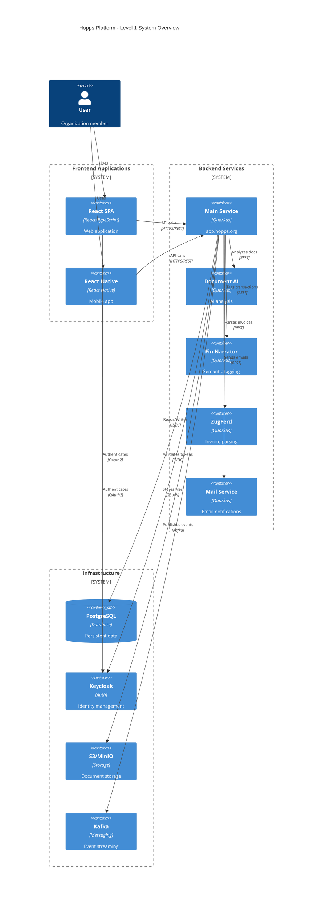
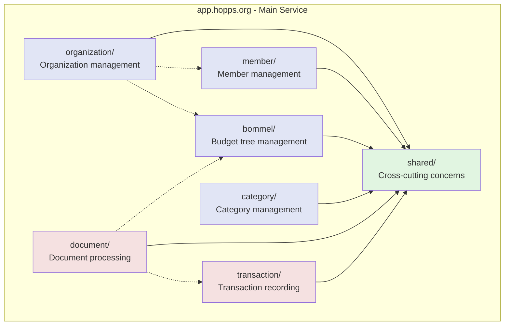
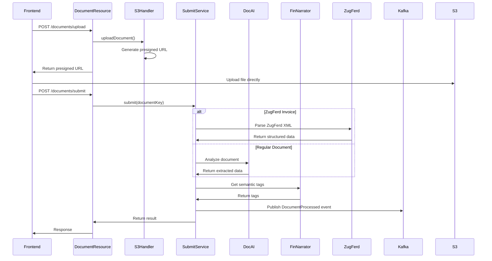
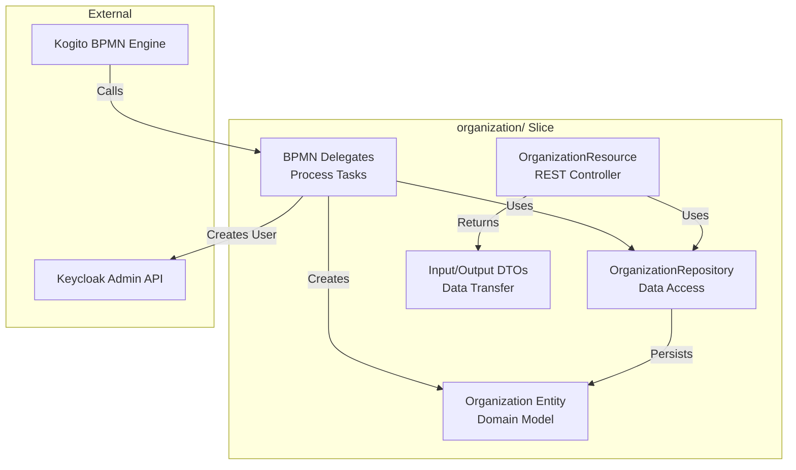
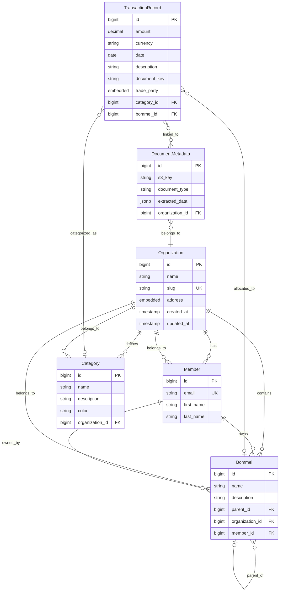

# 5. Building Block View

This chapter describes the static decomposition of the Hopps platform into building blocks (modules, components, subsystems) and their relationships.

---

## Whitebox Overall System

### Overview

The Hopps platform consists of frontend applications, backend microservices, and supporting infrastructure components.



### Contained Building Blocks

| Component | Responsibility |
|-----------|---------------|
| **Frontend Applications** | User interfaces for web and mobile |
| **Backend Services** | Business logic and API endpoints |
| **Infrastructure** | Supporting services (database, auth, storage, messaging) |

---

## Level 2: Backend Services Decomposition

### Whitebox Main Service (app.hopps.org)

The main service is organized using Vertical Slice Architecture with 6 business capability slices and 1 shared infrastructure layer.



### Vertical Slices

#### Slice 1: shared/
**Responsibility:** Common infrastructure and cross-cutting concerns

**Sub-packages:**
```
shared/
├── security/
│   └── SecurityUtils.java          # User/org retrieval from JWT
├── filter/
│   └── KogitoEndpointFilter.java   # OpenAPI endpoint filtering
├── validation/
│   ├── ValidationUtils.java
│   ├── RestValidator.java
│   └── NonUniqueConstraintViolation.java
└── infrastructure/
    └── storage/
        └── S3Handler.java           # S3 document upload/download
```

**Key Classes:**
- **SecurityUtils:** Extracts user organization from SecurityContext
- **S3Handler:** Handles document upload/download to S3
- **KogitoEndpointFilter:** Filters Kogito endpoints from OpenAPI docs
- **RestValidator:** Jakarta Bean Validation helper

---

#### Slice 2: organization/
**Responsibility:** Organization lifecycle management

**Sub-packages:**
```
organization/
├── api/
│   └── OrganizationResource.java     # REST endpoints
├── domain/
│   ├── Organization.java             # JPA entity
│   └── Address.java                  # Embedded address
├── repository/
│   └── OrganizationRepository.java   # Data access
├── service/
│   ├── PersistOrganizationDelegate.java      # BPMN delegate
│   ├── CreationValidationDelegate.java       # BPMN delegate
│   ├── CreateUserInKeycloak.java             # BPMN delegate
│   └── NoopDelegate.java
└── model/
    ├── NewOrganizationInput.java     # DTO for creation
    ├── OrganizationInput.java        # DTO for updates
    ├── OwnerInput.java               # Owner details
    └── CreateOrganizationResponse.java
```

**REST API:**
```
POST   /organizations               # Create new organization (BPMN)
GET    /organizations/{id}          # Get organization by ID
PUT    /organizations/{id}          # Update organization
GET    /organizations/{id}/members  # List members
```

**BPMN Process:**
- **NewOrganization.bpmn:** Orchestrates org creation with validation, Keycloak user creation, and persistence

**Domain Model:**
```java
@Entity
public class Organization extends PanacheEntity {
    @Column(nullable = false)
    private String name;

    @Column(unique = true, nullable = false)
    private String slug;

    @Embedded
    private Address address;

    @OneToMany(mappedBy = "organization")
    private Set<Member> members;

    @OneToMany(mappedBy = "organization")
    private Set<Bommel> bommels;

    @OneToMany(mappedBy = "organization")
    private Set<Category> categories;
}
```

---

#### Slice 3: member/
**Responsibility:** Member management and validation

**Sub-packages:**
```
member/
├── api/
│   └── MemberResource.java          # REST endpoints
├── domain/
│   └── Member.java                  # JPA entity
└── repository/
    └── MemberRepository.java        # Data access
```

**REST API:**
```
POST   /members/validate            # Validate member email
```

**Domain Model:**
```java
@Entity
public class Member extends PanacheEntity {
    @Column(unique = true, nullable = false)
    private String email;

    private String firstName;
    private String lastName;

    @ManyToMany
    @JoinTable(
        name = "member_organization",
        joinColumns = @JoinColumn(name = "member_id"),
        inverseJoinColumns = @JoinColumn(name = "organization_id")
    )
    private Set<Organization> organizations;
}
```

**Key Method:**
```java
public Member findByEmail(String email) {
    return find("email", email).firstResult();
}
```

---

#### Slice 4: bommel/
**Responsibility:** Hierarchical budget tree management

**Sub-packages:**
```
bommel/
├── api/
│   └── BommelResource.java          # REST endpoints
├── domain/
│   ├── Bommel.java                  # JPA entity (tree node)
│   └── TreeSearchBommel.java        # Search result DTO
├── repository/
│   └── BommelRepository.java        # Tree operations
└── model/
    └── BommelInput.java             # Record DTO
```

**REST API:**
```
GET    /bommels                      # List all bommels for org
POST   /bommels                      # Create new bommel
GET    /bommels/{id}                 # Get bommel by ID
PUT    /bommels/{id}                 # Update bommel
DELETE /bommels/{id}                 # Delete bommel
GET    /bommels/{id}/parents         # Get parent chain
GET    /bommels/{id}/children        # Get direct children
GET    /bommels/{id}/all-children    # Get all descendants
POST   /bommels/{id}/move            # Move bommel to new parent
```

**Domain Model:**
```java
@Entity
@Table(name = "bommel")
@NamedQueries({
    @NamedQuery(
        name = "Bommel.getParents",
        query = """
            WITH RECURSIVE parents AS (
                SELECT id, parent_id, name, 1 as level
                FROM bommel
                WHERE id = :bommelId

                UNION ALL

                SELECT b.id, b.parent_id, b.name, p.level + 1
                FROM bommel b
                INNER JOIN parents p ON b.id = p.parent_id
            )
            SELECT * FROM parents ORDER BY level DESC
            """
    )
})
public class Bommel extends PanacheEntity {
    @Column(nullable = false)
    private String name;

    private String description;

    @ManyToOne
    @JoinColumn(name = "parent_id")
    private Bommel parent;

    @OneToMany(mappedBy = "parent")
    private Set<Bommel> children;

    @ManyToOne
    @JoinColumn(name = "organization_id", nullable = false)
    private Organization organization;

    @ManyToOne
    @JoinColumn(name = "member_id", nullable = false)
    private Member member;
}
```

**Key Operations:**
- **getParents():** Recursive CTE to get ancestor chain
- **getChildrenRecursive():** Get all descendants
- **moveBommel():** Move node with cycle detection
- **ensureNoCycleFromBommel():** Prevent circular references

---

#### Slice 5: category/
**Responsibility:** Expense category management

**Sub-packages:**
```
category/
├── api/
│   └── CategoryResource.java        # REST endpoints
├── domain/
│   └── Category.java                # JPA entity
├── repository/
│   └── CategoryRepository.java      # Data access
└── model/
    └── CategoryInput.java           # Record DTO
```

**REST API:**
```
GET    /categories                   # List categories for org
POST   /categories                   # Create category
GET    /categories/{id}              # Get category by ID
PUT    /categories/{id}              # Update category
DELETE /categories/{id}              # Delete category
```

**Domain Model:**
```java
@Entity
public class Category extends PanacheEntity {
    @Column(nullable = false)
    private String name;

    private String description;

    private String color;  // Hex color code

    @ManyToOne
    @JoinColumn(name = "organization_id", nullable = false)
    private Organization organization;
}
```

---

#### Slice 6: document/
**Responsibility:** Document upload, analysis, and submission

**Sub-packages:**
```
document/
├── api/
│   └── DocumentResource.java        # REST endpoints
├── domain/
│   ├── DocumentType.java            # Enum (INVOICE, RECEIPT, etc.)
│   ├── DocumentData.java            # Abstract base
│   ├── InvoiceData.java             # Invoice-specific data
│   ├── ReceiptData.java             # Receipt-specific data
│   └── Data.java                    # Generic data wrapper
├── service/
│   └── SubmitService.java           # Document submission logic
├── client/
│   ├── DocumentAnalyzeClient.java   # REST client to AI service
│   ├── FinNarratorClient.java       # REST client to narrator
│   ├── ZugFerdClient.java           # REST client to ZugFerd
│   └── dto/
│       └── BommelDto.java           # DTO for client (renamed from Bommel)
└── messaging/
    └── DocumentProducer.java        # Kafka event publisher
```

**REST API:**
```
POST   /documents/upload             # Upload document to S3
POST   /documents/submit             # Submit document for processing
```

**Document Processing Flow:**


**Domain Models:**
```java
public enum DocumentType {
    INVOICE,
    RECEIPT,
    CONTRACT,
    OTHER
}

public abstract class DocumentData {
    private DocumentType type;
    private LocalDate date;
    private BigDecimal amount;
    private String currency;
}

public class InvoiceData extends DocumentData {
    private String invoiceNumber;
    private String vendorName;
    private String vendorTaxId;
    private List<LineItem> lineItems;
}

public class ReceiptData extends DocumentData {
    private String merchantName;
    private String location;
    private String paymentMethod;
}
```

---

#### Slice 7: transaction/
**Responsibility:** Transaction recording and management

**Sub-packages:**
```
transaction/
├── api/
│   └── TransactionRecordResource.java  # REST endpoints
├── domain/
│   ├── TransactionRecord.java          # JPA entity
│   └── TradeParty.java                 # Vendor/Customer info
└── repository/
    └── TransactionRecordRepository.java
```

**REST API:**
```
GET    /transaction-records          # List transactions
POST   /transaction-records          # Create transaction
GET    /transaction-records/{id}     # Get transaction
PUT    /transaction-records/{id}     # Update transaction
DELETE /transaction-records/{id}     # Delete transaction
```

**Domain Model:**
```java
@Entity
public class TransactionRecord extends PanacheEntity {
    private BigDecimal amount;
    private String currency;
    private LocalDate date;
    private String description;

    @Column(name = "document_key")
    private String documentKey;  // S3 key linking to document

    @Embedded
    private TradeParty tradeParty;

    @ManyToOne
    private Category category;

    @ManyToOne
    private Bommel bommel;
}

@Embeddable
public class TradeParty {
    private String name;
    private String taxId;
    private String address;
}
```

---

## Level 3: Component Details (Example: Organization Slice)

### Whitebox organization/ Slice



### Component Responsibilities

#### OrganizationResource
**Type:** REST Controller
**Responsibility:** HTTP endpoint handling

```java
@Path("/organizations")
@Authenticated
public class OrganizationResource {

    @Inject
    OrganizationRepository repository;

    @Inject
    SecurityUtils securityUtils;

    @Inject
    Process<NewOrganizationModel> process;

    @POST
    @Transactional
    public Response createOrganization(NewOrganizationInput input) {
        // Start BPMN process
        NewOrganizationModel model = process.createModel();
        model.setInput(input);

        ProcessInstance<NewOrganizationModel> instance = process.createInstance(model);
        instance.start();

        return Response.status(201)
            .entity(instance.variables().getOrganization())
            .build();
    }

    @GET
    @Path("/{id}")
    public Organization get(@PathParam("id") Long id, @Context SecurityContext ctx) {
        Organization org = securityUtils.getUserOrganization(ctx);

        // Ensure user can only access their own organization
        if (!org.id.equals(id)) {
            throw new WebApplicationException(403);
        }

        return repository.findById(id);
    }
}
```

#### OrganizationRepository
**Type:** Data Access Layer
**Responsibility:** Database operations

```java
@ApplicationScoped
public class OrganizationRepository implements PanacheRepository<Organization> {

    public Organization findBySlug(String slug) {
        return find("slug", slug).firstResult();
    }

    public List<Organization> findByMember(Member member) {
        return find("SELECT o FROM Organization o JOIN o.members m WHERE m = ?1", member).list();
    }

    public boolean slugExists(String slug) {
        return count("slug", slug) > 0;
    }
}
```

#### Organization (Domain Entity)
**Type:** JPA Entity
**Responsibility:** Domain model

```java
@Entity
@Table(name = "organization")
public class Organization extends PanacheEntity {

    @Column(nullable = false, length = 255)
    @NotBlank
    private String name;

    @Column(unique = true, nullable = false, length = 100)
    @NotBlank
    @Pattern(regexp = "^[a-z0-9-]+$")
    private String slug;

    @Embedded
    private Address address;

    @Column(name = "created_at", nullable = false)
    private Instant createdAt;

    @Column(name = "updated_at", nullable = false)
    private Instant updatedAt;

    @OneToMany(mappedBy = "organization", cascade = CascadeType.ALL)
    private Set<Member> members = new HashSet<>();

    @OneToMany(mappedBy = "organization", cascade = CascadeType.ALL)
    private Set<Bommel> bommels = new HashSet<>();

    @PrePersist
    void onCreate() {
        createdAt = Instant.now();
        updatedAt = Instant.now();
    }

    @PreUpdate
    void onUpdate() {
        updated At = Instant.now();
    }
}

@Embeddable
public class Address {
    private String street;
    private String city;
    private String postalCode;
    private String country = "DE";
}
```

#### BPMN Delegates
**Type:** Process Task Handlers
**Responsibility:** Execute BPMN service tasks

**CreationValidationDelegate:**
```java
@ApplicationScoped
@Named("CreationValidationDelegate")
public class CreationValidationDelegate implements WorkItemHandler {

    @Inject
    Validator validator;

    @Inject
    OrganizationRepository repository;

    @Override
    public void executeWorkItem(WorkItem workItem, WorkItemManager manager) {
        NewOrganizationInput input = (NewOrganizationInput) workItem.getParameter("input");

        // Jakarta Bean Validation
        Set<ConstraintViolation<NewOrganizationInput>> violations = validator.validate(input);
        if (!violations.isEmpty()) {
            throw new ConstraintViolationException(violations);
        }

        // Business validation
        if (repository.slugExists(input.getSlug())) {
            throw new NonUniqueConstraintViolation("slug", input.getSlug());
        }

        manager.completeWorkItem(workItem.getId(), Map.of("valid", true));
    }
}
```

**PersistOrganizationDelegate:**
```java
@ApplicationScoped
@Named("PersistOrganizationDelegate")
public class PersistOrganizationDelegate implements WorkItemHandler {

    @Inject
    OrganizationRepository repository;

    @Override
    @Transactional
    public void executeWorkItem(WorkItem workItem, WorkItemManager manager) {
        OrganizationInput input = (OrganizationInput) workItem.getParameter("input");

        Organization org = new Organization();
        org.setName(input.getName());
        org.setSlug(input.getSlug());
        org.setAddress(input.getAddress());

        repository.persist(org);

        Map<String, Object> results = Map.of(
            "organizationId", org.id,
            "organization", org
        );

        manager.completeWorkItem(workItem.getId(), results);
    }
}
```

**CreateUserInKeycloak:**
```java
@ApplicationScoped
@Named("CreateUserInKeycloak")
public class CreateUserInKeycloak implements WorkItemHandler {

    @Inject
    @RestClient
    Keycloak keycloak;

    @Override
    public void executeWorkItem(WorkItem workItem, WorkItemManager manager) {
        OwnerInput owner = (OwnerInput) workItem.getParameter("owner");

        UserRepresentation user = new UserRepresentation();
        user.setEmail(owner.getEmail());
        user.setUsername(owner.getEmail());
        user.setFirstName(owner.getFirstName());
        user.setLastName(owner.getLastName());
        user.setEnabled(true);

        Response response = keycloak.realm("hopps").users().create(user);

        if (response.getStatus() != 201) {
            throw new RuntimeException("Failed to create user in Keycloak");
        }

        String userId = extractUserId(response);
        manager.completeWorkItem(workItem.getId(), Map.of("keycloakUserId", userId));
    }
}
```

---

## Domain Relationships

### Entity Relationship Diagram



### Key Relationships

1. **Organization ↔ Member:** Many-to-Many (currently enforced as One-to-Many)
2. **Organization ↔ Bommel:** One-to-Many (hierarchical budgets)
3. **Bommel ↔ Bommel:** Self-referential (tree structure)
4. **Organization ↔ Category:** One-to-Many (expense categories)
5. **TransactionRecord ↔ Category:** Many-to-One (categorization)
6. **TransactionRecord ↔ Bommel:** Many-to-One (budget allocation)

---

## Other Microservices

### app.hopps.az-document-ai
**Responsibility:** AI-powered document analysis

**Key Components:**
- Machine learning models for text extraction
- OCR for scanned documents
- Classification (invoice vs receipt)
- Field extraction (amounts, dates, vendors)

**Technology:**
- Quarkus
- TensorFlow/PyTorch models
- OCR libraries (Tesseract)

---

### app.hopps.fin-narrator
**Responsibility:** Semantic tagging of financial transactions

**Key Components:**
- NLP models for transaction description analysis
- Category suggestion engine
- Learning from user corrections

**Technology:**
- Quarkus
- NLP libraries (spaCy, transformers)

---

### app.hopps.zugferd
**Responsibility:** ZugFerd electronic invoice parsing

**Key Components:**
- XML parser for ZugFerd format
- PDF extractor
- Validation against ZugFerd schema

**Technology:**
- Quarkus
- XML parsing libraries

---

### app.hopps.mailservice
**Responsibility:** Email notifications

**Key Components:**
- Email template engine
- SMTP client
- Queue-based email sending
- Bounce handling

**Technology:**
- Quarkus
- Qute templating
- Jakarta Mail API

---

## Frontend Applications

### React SPA
**Structure:**
```
spa/
├── src/
│   ├── components/          # Reusable UI components
│   │   ├── OrganizationCard/
│   │   ├── BommelTree/
│   │   └── DocumentUpload/
│   ├── pages/               # Page components
│   │   ├── Organizations/
│   │   ├── Budget/
│   │   ├── Documents/
│   │   └── Transactions/
│   ├── hooks/               # Custom React hooks
│   │   ├── useAuth.ts
│   │   ├── useApi.ts
│   │   └── useOrganization.ts
│   ├── services/            # API service layer
│   │   ├── organizationService.ts
│   │   ├── documentService.ts
│   │   └── authService.ts
│   └── App.tsx              # Main app component
```

---

### React Native Mobile
**Structure:**
```
mobile/
├── src/
│   ├── components/          # Mobile-optimized components
│   ├── screens/             # App screens
│   ├── navigation/          # Navigation config
│   └── App.tsx
```

---

## Summary

The Hopps platform building blocks are organized as follows:

1. **Vertical Slice Architecture** in main service (6 slices + shared)
2. **Specialized Microservices** for AI, parsing, and email
3. **Layered Structure** within each slice (API → Service → Repository → Domain)
4. **Clear Dependencies** with shared infrastructure and minimal cross-slice coupling
5. **Domain-Driven Design** with rich domain models

This structure enables:
- **High Cohesion:** Related code together in slices
- **Low Coupling:** Clear interfaces between slices
- **Maintainability:** Easy to navigate and understand
- **Scalability:** Independent scaling of services
- **Testability:** Isolated testing of slices

---

**Document Version:** 1.0
**Last Updated:** 2025-11-12
**Status:** Active
