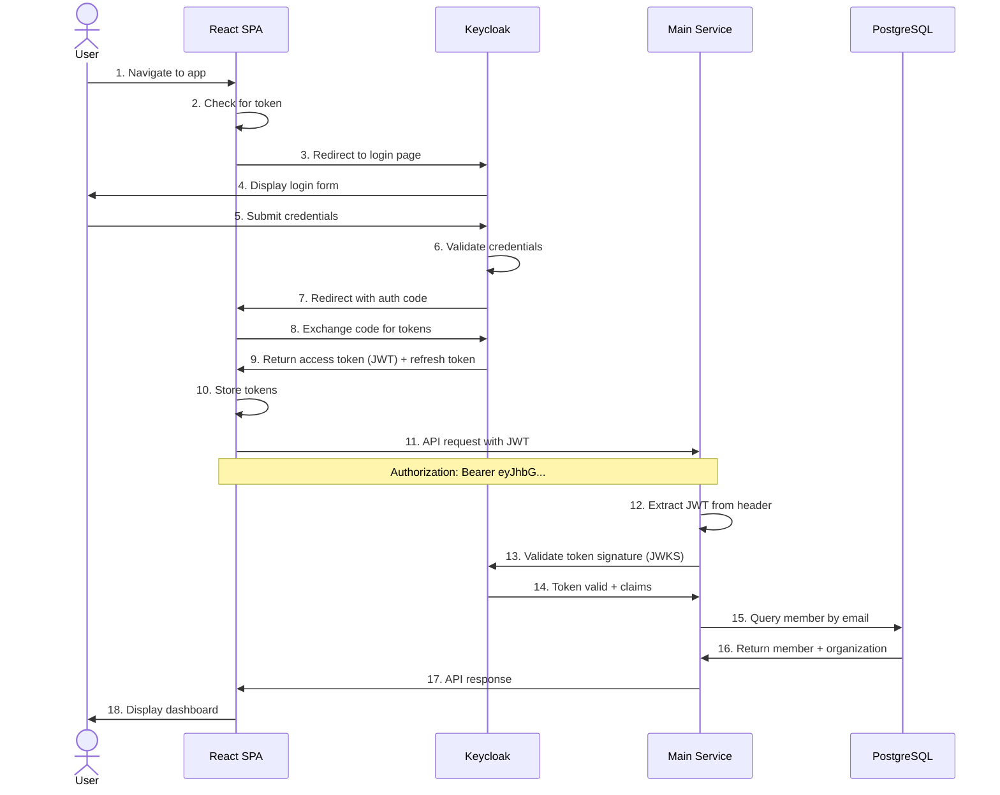
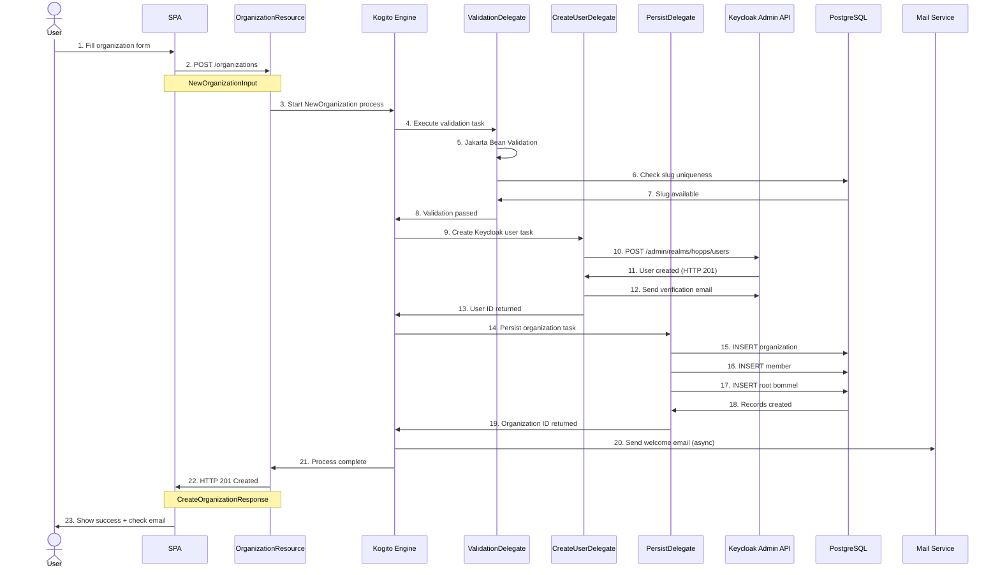
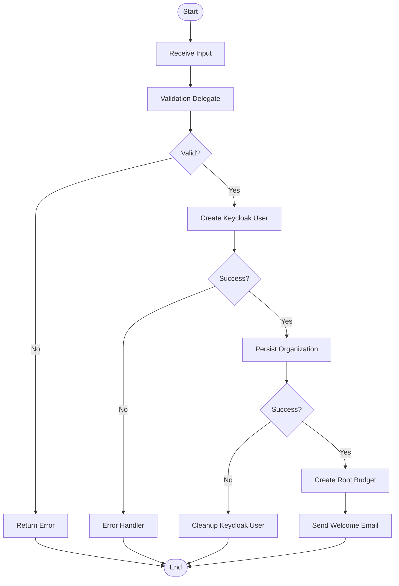
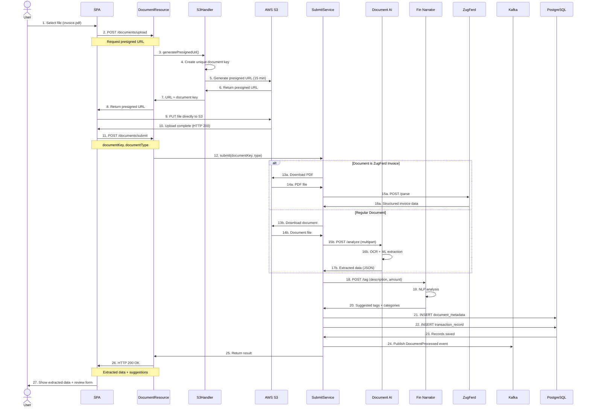
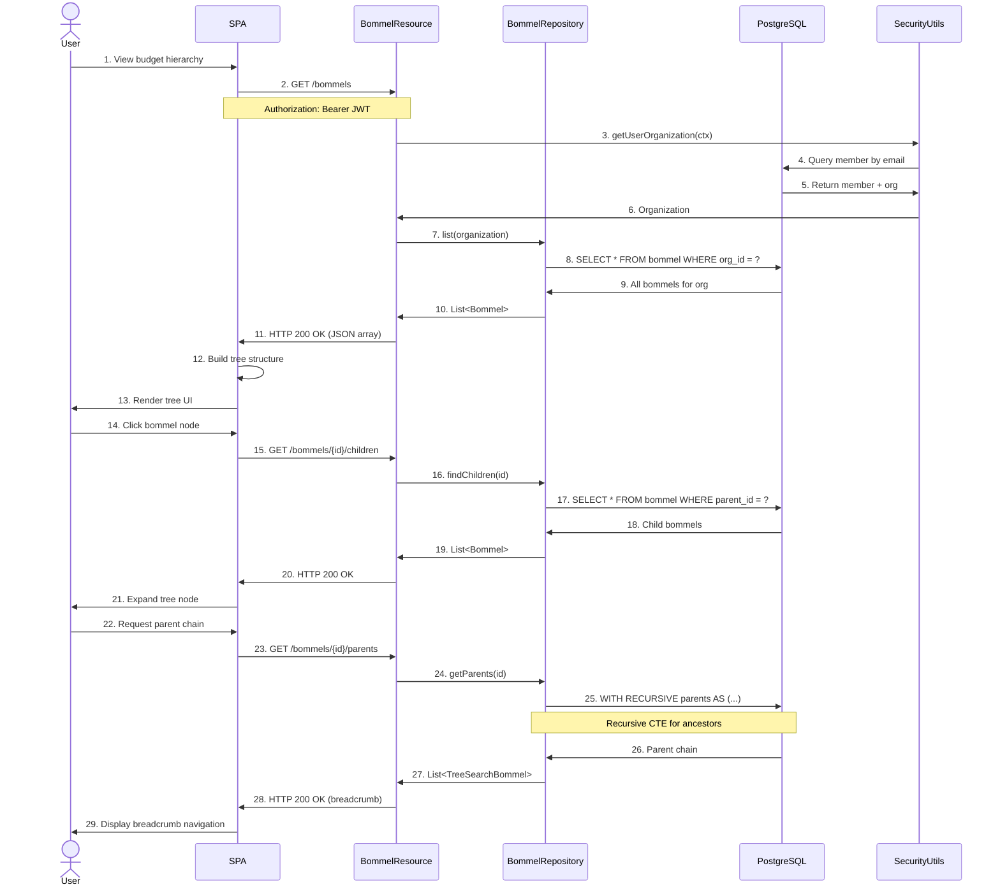
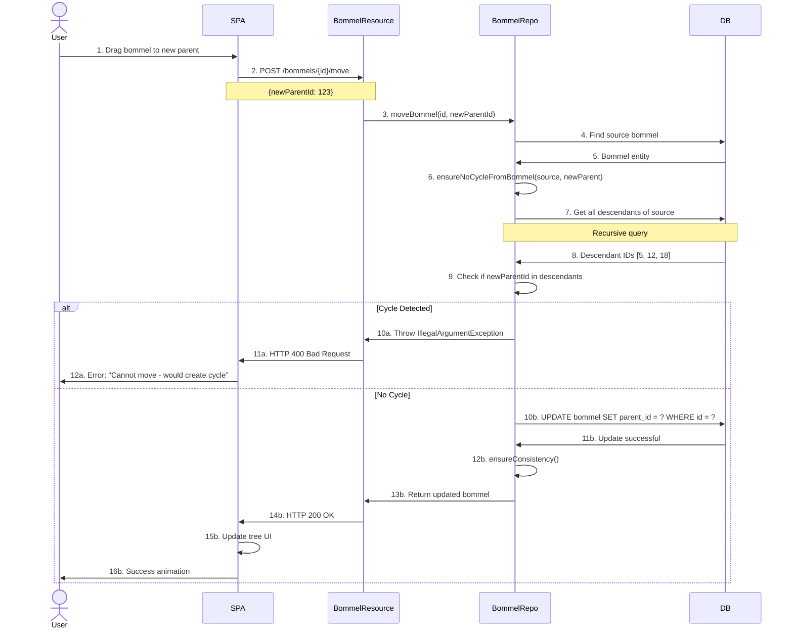
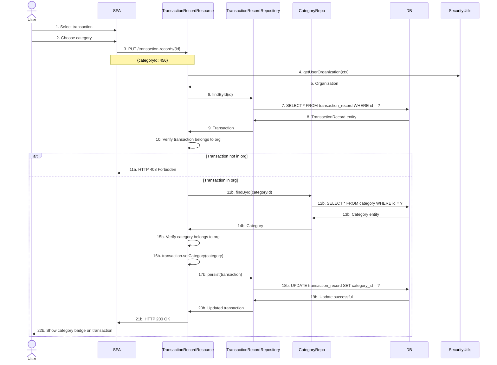
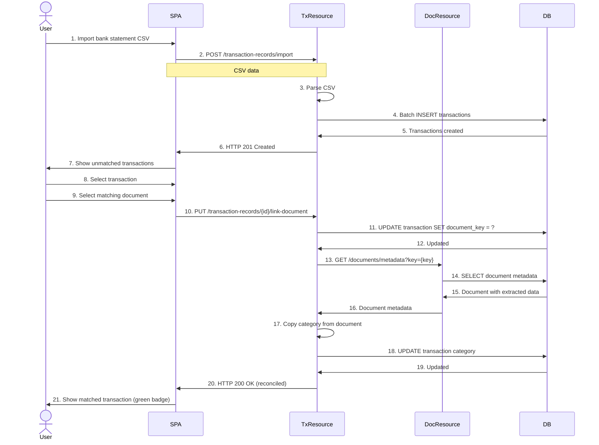

# 6. Runtime View

This chapter describes the runtime behavior of the Hopps platform through key scenarios and sequence diagrams.

---

## Scenario 1: User Authentication Flow

### Overview
User authenticates with Keycloak and receives JWT token for API access.

### Sequence Diagram



### Steps Description

1-3. **Initial Access:** User navigates to app, SPA checks for existing token, redirects to Keycloak if missing
4-5. **User Authentication:** Keycloak presents login form, user submits credentials
6-7. **Authorization Code:** Keycloak validates and returns authorization code
8-9. **Token Exchange:** SPA exchanges code for JWT access token (Authorization Code Flow with PKCE)
10. **Token Storage:** SPA stores tokens in memory (not localStorage for security)
11-14. **API Authentication:** Backend validates JWT signature using Keycloak's public keys (JWKS)
15-16. **User Context:** Backend retrieves user organization from database
17-18. **Response:** API returns data, SPA renders user interface

### Key Components
- **Keycloak:** Identity provider (OAuth2/OIDC)
- **JWT Token:** Contains user identity and claims
- **SecurityUtils:** Extracts user organization from token

---

## Scenario 2: Organization Creation (BPMN Workflow)

### Overview
New organization created through automated BPMN process including validation, Keycloak user creation, and persistence.

### Sequence Diagram



### BPMN Process Diagram



### Delegates

**CreationValidationDelegate:**
- Validates input against Jakarta Bean Validation annotations
- Checks slug uniqueness in database
- Returns validation result to BPMN

**CreateUserInKeycloak:**
- Creates user in Keycloak via Admin REST API
- Sets username = email, enabled = true
- Triggers verification email
- Returns Keycloak user ID

**PersistOrganizationDelegate:**
- Creates Organization entity
- Creates Member entity for owner
- Links member to organization
- Creates root Bommel node
- All in single transaction

### Error Handling
- **Validation Fails:** Returns 400 Bad Request immediately
- **Keycloak Fails:** BPMN error handler, no database changes
- **Persistence Fails:** Attempts Keycloak user deletion (compensation)

---

## Scenario 3: Document Upload and AI Analysis

### Overview
User uploads document, which is stored in S3 and analyzed by AI service.

### Sequence Diagram



### Upload Strategy
**Direct Upload to S3:**
- Frontend requests presigned URL from backend
- Frontend uploads directly to S3 (no backend bottleneck)
- Backend generates presigned URL with 15-minute expiry
- S3 enforces security via temporary credentials

**Benefits:**
- Reduced backend load
- Faster uploads (no proxy)
- Scalable (S3 handles traffic)

### AI Analysis Flow

**ZugFerd Path:**
1. Detect ZugFerd format (embedded XML in PDF)
2. Parse XML structure
3. Extract structured invoice data
4. High confidence (machine-readable)

**Regular Document Path:**
1. OCR for scanned documents
2. ML models extract fields (amount, date, vendor)
3. Lower confidence (requires review)
4. User can correct extraction

### Kafka Event

```json
{
  "eventType": "DocumentProcessed",
  "documentId": "doc-123",
  "organizationId": "org-456",
  "processedAt": "2024-11-12T10:30:00Z",
  "extractedData": {
    "type": "INVOICE",
    "amount": 1234.56,
    "currency": "EUR",
    "date": "2024-11-10",
    "vendor": "Acme Corp"
  },
  "suggestedCategory": "IT Infrastructure",
  "confidence": 0.92
}
```

---

## Scenario 4: Bommel Tree Navigation

### Overview
User navigates hierarchical budget structure (Bommel tree).

### Sequence Diagram



### Recursive Query

**Get Parents (Ancestors):**
```sql
WITH RECURSIVE parents AS (
    -- Base case: start with target bommel
    SELECT id, parent_id, name, 1 as level
    FROM bommel
    WHERE id = ?

    UNION ALL

    -- Recursive case: get parent of current node
    SELECT b.id, b.parent_id, b.name, p.level + 1
    FROM bommel b
    INNER JOIN parents p ON b.id = p.parent_id
)
SELECT * FROM parents ORDER BY level DESC;
```

**Example Result:**
```
Root Budget (level 3)
└── Marketing (level 2)
    └── Social Media (level 1)  ← Current bommel
```

**Get Children Recursively (Descendants):**
```sql
WITH RECURSIVE children AS (
    SELECT id, parent_id, name, 0 as depth
    FROM bommel
    WHERE id = ?

    UNION ALL

    SELECT b.id, b.parent_id, b.name, c.depth + 1
    FROM bommel b
    INNER JOIN children c ON b.parent_id = c.id
)
SELECT * FROM children WHERE id != ? ORDER BY depth;
```

---

## Scenario 5: Move Bommel with Cycle Detection

### Overview
User moves bommel node to new parent, system prevents circular references.

### Sequence Diagram



### Cycle Detection Algorithm

```java
public void ensureNoCycleFromBommel(Bommel source, Bommel newParent) {
    if (newParent == null) {
        return; // Moving to root is always safe
    }

    // Get all descendants of source bommel
    Set<Long> descendants = getAllChildrenIds(source.id);

    // Check if new parent is a descendant
    if (descendants.contains(newParent.id)) {
        throw new IllegalArgumentException(
            "Cannot move bommel: would create a cycle"
        );
    }
}
```

**Example:**
```
Root
├── A
│   ├── B
│   │   └── C  ← Try to move A here
│   └── D
└── E
```

**Result:** ❌ Rejected - A cannot be child of C because C is already descendant of A

---

## Scenario 6: Category Assignment to Transaction

### Overview
User assigns category to transaction record.

### Sequence Diagram



### Multi-Tenant Security
- Every operation validates organization ownership
- Prevents cross-organization data access
- SecurityUtils extracts user organization from JWT
- All queries filtered by organization ID

---

## Scenario 7: Transaction Reconciliation

### Overview
Match bank transaction with document and categorize.

### Sequence Diagram



---

## Performance Considerations

### Database Query Optimization

**Bommel Tree Queries:**
- Recursive CTEs for ancestor/descendant queries
- Indexed on `parent_id` for fast tree traversal
- Materialized path pattern (future optimization)

**Organization Scoping:**
- All queries filtered by `organization_id`
- Index on foreign keys
- Prevents full table scans

**Caching Strategy:**
- Keycloak JWKS cached for 1 hour
- User organization cached in request scope
- Category list cached for 5 minutes

---

## Error Handling Patterns

### Transactional Boundaries

```java
@Transactional
public void createOrganization(Input input) {
    // All database operations in single transaction
    // Rollback on any exception
}
```

### BPMN Error Handling

```xml
<bpmn:serviceTask id="createUser" implementation="Java">
    <bpmn:extensionElements>
        <errorEventDefinition errorRef="UserCreationError"/>
    </bpmn:extensionElements>
</bpmn:serviceTask>
```

### Retry Logic

```yaml
# REST client retry configuration
quarkus:
  rest-client:
    document-analyze:
      max-attempts: 3
      delay: 1s
      max-delay: 5s
```

---

## Summary

The Hopps platform runtime behavior demonstrates:

1. **OAuth2/OIDC Authentication** with Keycloak and JWT
2. **BPMN Orchestration** for complex workflows
3. **Event-Driven Processing** with Kafka
4. **Multi-Tenant Security** with organization scoping
5. **Direct S3 Upload** for performance
6. **Recursive Queries** for tree structures
7. **Cycle Detection** for data integrity
8. **Transactional Consistency** across operations

---

**Document Version:** 1.0
**Last Updated:** 2025-11-12
**Status:** Active
