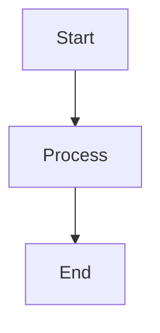

# Documentation Development Guide

This guide explains how to work with the Hopps architecture documentation locally.

## Quick Start

### Prerequisites

- Ruby 2.7+ with Bundler
- Git

### Local Development

1. **Install dependencies:**
   ```bash
   cd docs
   bundle install
   ```

2. **Run local server:**
   ```bash
   bundle exec jekyll serve
   ```

3. **View documentation:**
   Open http://localhost:4000/hopps/ in your browser

## Structure

```
docs/
├── _layouts/
│   └── default.html          # Custom layout with sidebar navigation
├── assets/
│   └── css/
│       └── style.css         # Custom CSS with Hopps brand colors
├── _config.yml               # Jekyll configuration
├── index.md                  # Documentation home page
├── 01_introduction.md        # Chapter 1: Introduction and Goals
├── 02_architecture_constraints.md  # Chapter 2: Constraints
├── 03_context.md             # Chapter 3: System Context
├── 04_solution_strategy.md   # Chapter 4: Solution Strategy
├── 05_building_blocks.md     # Chapter 5: Building Blocks
├── 06_runtime_view.md        # Chapter 6: Runtime View
├── 07_deployment_view.md     # Chapter 7: Deployment
├── 08_crosscutting_concepts.md  # Chapter 8: Cross-cutting
├── 09_architecture_decisions.md  # Chapter 9: ADRs
├── 10_quality_scenarios.md   # Chapter 10: Quality
├── 11_technical_risks.md     # Chapter 11: Risks
└── 12_glossary.md            # Chapter 12: Glossary
```

## Theme Customization

### Colors

The documentation uses the Hopps application color scheme defined in `assets/css/style.css`:

**Purple Scale:**
- Primary: `#9955CC` (purple-500)
- Range: `#F5EEFA` (lightest) to `#1C0C28` (darkest)

**Grey Scale:**
- Black: `#000000`
- White: `#FFFFFF`
- Various grays: `#4E4E4E` to `#F5F5F5`

**Application Colors:**
- Primary: Purple-500 (#9955CC)
- Background: Purple-50 (#F5EEFA)
- Font: Reddit Sans

### Customizing the Theme

To modify the theme:

1. **Colors:** Edit CSS variables in `assets/css/style.css` (lines 10-40)
2. **Layout:** Modify `_layouts/default.html`
3. **Navigation:** Update sidebar structure in `_layouts/default.html` (lines 32-150)
4. **Fonts:** Change font imports and `font-family` in `assets/css/style.css`

## Adding New Pages

1. Create new `.md` file in `docs/` directory
2. Add front matter:
   ```yaml
   ---
   layout: default
   title: "Page Title"
   description: "Page description"
   ---
   ```
3. Add navigation link to `_layouts/default.html` if needed

## Diagrams

The documentation uses Mermaid for diagrams. Mermaid is loaded via CDN and configured in `_layouts/default.html`.

**Example:**
````markdown

````

## Code Blocks

Syntax highlighting is provided by highlight.js (Atom One Light theme).

**Example:**
````markdown
```java
public class Example {
    public void method() {
        System.out.println("Hello");
    }
}
```
````

## Publishing

The documentation is automatically published to GitHub Pages when changes are pushed to the main branch.

**GitHub Pages URL:** https://[your-org].github.io/hopps/

To configure:
1. Go to repository Settings → Pages
2. Set source to "main" branch, "/docs" folder
3. Save

## Testing Before Commit

Always test locally before committing:

```bash
# Start local server
bundle exec jekyll serve

# Check for:
# ✓ All pages load correctly
# ✓ Navigation links work
# ✓ Mermaid diagrams render
# ✓ Code blocks have syntax highlighting
# ✓ Colors match brand guidelines
# ✓ Mobile responsive design works
```

## Common Issues

### Mermaid Diagrams Not Rendering
- Ensure code blocks use triple backticks with `mermaid` language tag
- Check browser console for JavaScript errors
- Verify Mermaid CDN is accessible

### Navigation Not Highlighting Current Page
- Check that URL patterns in `_layouts/default.html` match page URLs
- Verify front matter includes `layout: default`

### Styles Not Loading
- Clear browser cache
- Check that `assets/css/style.css` exists
- Verify `_layouts/default.html` includes CSS link

### Local Server Won't Start
- Run `bundle install` to ensure dependencies are installed
- Check Ruby version: `ruby --version` (should be 2.7+)
- Try `bundle exec jekyll serve --trace` for detailed errors

## Resources

- [Jekyll Documentation](https://jekyllrb.com/docs/)
- [GitHub Pages Documentation](https://docs.github.com/en/pages)
- [Mermaid Documentation](https://mermaid.js.org/)
- [arc42 Template](https://arc42.org/)
- [Markdown Guide](https://www.markdownguide.org/)
